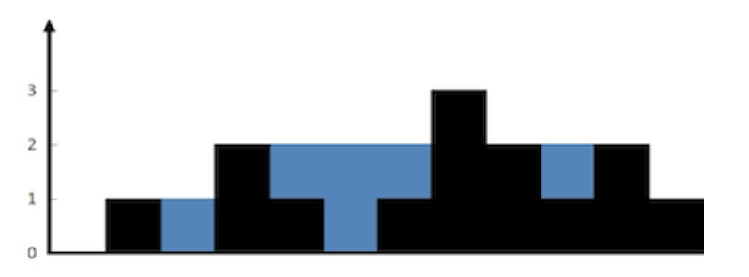

<div align='center' ><font size='70'>直方图的水量</font></div>

# 题目描述

<a href="https://leetcode-cn.com/problems/volume-of-histogram-lcci/" target="_blank">题目链接</a>

题目描述 

给定一个直方图(也称柱状图)，假设有人从上面源源不断地倒水，最后直方图能存多少水量?直方图的宽度为 1。



上面是由数组 [0,1,0,2,1,0,1,3,2,1,2,1] 表示的直方图，在这种情况下，可以接 6 个单位的水（蓝色部分表示水）。 感谢 Marcos 贡献此图。


示例 ：

输入： [0,1,0,2,1,0,1,3,2,1,2,1]

输出：6


# 解题思路

**每个水池能接的水量是由它左边最高的水池(max_l)和右边最高的水池(max_r)决定的**，有点类似于木桶的短板效应，接水量 = min(max_l,max_r) - 当前水池高度，注意接水量为非负数。

定义dp_l[i] 代表第i个水池左边最高的水池的高度，dp_r[i] 代表第i个水池右边最高的水池的高度, 根据上面的推理公式，把结果累加起来就是总接水量。

# 代码

```cpp

#define maxn 100100
class Solution {
public:
    int trap(vector<int>& height) {
        
        
        int len = height.size();
        int dp_l[maxn];
        int dp_r[maxn];
        
        if(!len) return 0;

        dp_l[0] = 0;
        dp_r[len - 1] = 0;

        for(int i = 1; i < len; i++) dp_l[i] = max(dp_l[i - 1], height[i - 1]);
        for(int i = len - 2; i >= 0; i--) dp_r[i] = max(dp_r[i + 1], height[i + 1]);

        int ans = 0;
        for(int i = 0; i < len; i++) {
            ans += (min(dp_l[i],dp_r[i]) - height[i] >= 0 ? min(dp_l[i],dp_r[i]) - height[i] : 0);
        }

        return ans;
    }
};

```

