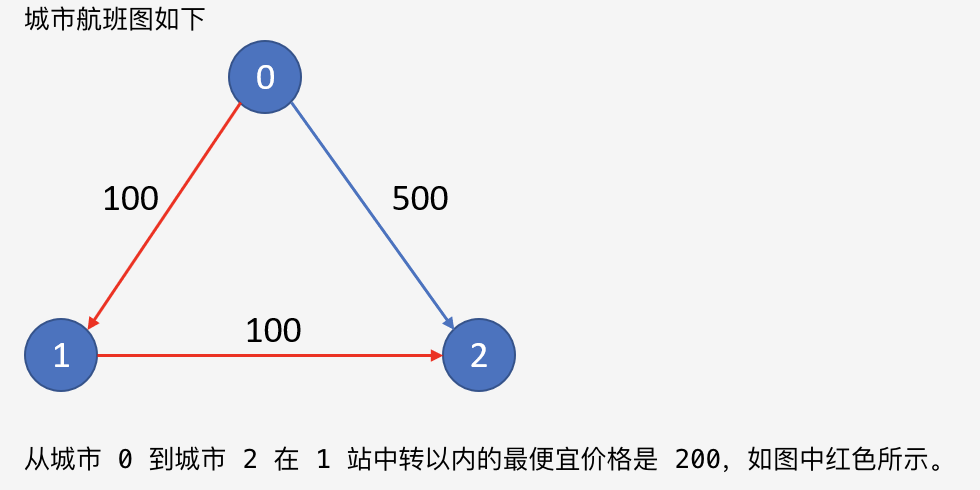
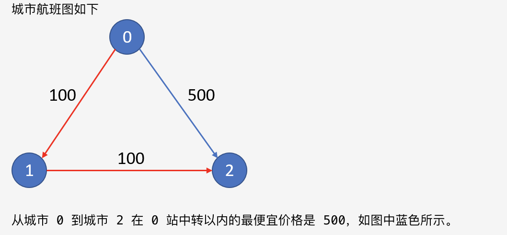

<div align='center' ><font size='70'>K站中转内最便宜的航班</font></div>

# 题目描述

<a href="https://leetcode-cn.com/problems/cheapest-flights-within-k-stops/">题目链接</a>

题目描述 :

有 n 个城市通过 m 个航班连接。每个航班都从城市 u 开始，以价格 w 抵达 v。

现在给定所有的城市和航班，以及出发城市 src 和目的地 dst，你的任务是找到从 src 到 dst 最多经过 k 站中转的最便宜的价格。 如果没有这样的路线，则输出 -1。

示例 1：

输入:

n = 3, edges = [[0,1,100],[1,2,100],[0,2,500]]

src = 0, dst = 2, k = 1

输出: 200

解释:



示例 2：

输入:

n = 3, edges = [[0,1,100],[1,2,100],[0,2,500]]

src = 0, dst = 2, k = 0

输出: 500

解释:




# 解题思路

这个问题有点类似于最短路径问题，应该可以用Dijkstra算法实现，但是这里需要考虑中转站的限制次数。比如示例2中，如果不考虑中转站，那最短路径就是0-1-2，cost为200。但是考虑到不能有中转，所以只能选0-2，cost为500。

可以用邻接矩阵存储这个有向图。再去维护一个小根堆，堆中的每个元素记为（累计费用，当前位置，剩余步数）。始终把累计费用最小的结点放在堆顶。

最先入堆的是起点，累计费用为0，当前位置是src，剩余步数为k+1。

从堆顶取走的元素，如果位置已经是终点，返回累计费用。

否则，去遍历它能够到达的邻接结点。不过在遍历以前还需要判断还能不能走，如果remainSteps为0了，那就不能继续往下走了。

设置堆的好处和必要性在于，每次取走的堆顶元素，都是累计费用最小的。不会出现"累计费用很大，已经到达终点，所以就将这个费用输出"的情况，因为只要还有更小的累计费用的路径存在，就一定会优先去看那条路径继续往下走能否走到终点。


# 代码


```java
class Solution {
    public int findCheapestPrice(int n, int[][] flights, int src, int dst, int K) {
        int[][] graph = new int[n][n];
        for (int[] f : flights) {
            graph[f[0]][f[1]] = f[2];
        }
        PriorityQueue<int[]> heap = new PriorityQueue<>(Comparator.comparing(a -> a[0]));
        heap.offer(new int[]{0, src, K + 1});
        while (!heap.isEmpty()) {
            int[] cur = heap.poll();
            int price = cur[0];
            int place = cur[1];
            int remainSteps = cur[2];
            if (place == dst) {
                return price;
            }
            if (remainSteps > 0) {
                for (int i = 0; i < n; i++) {
                    if (graph[place][i] != 0) {
                        heap.offer(new int[]{price + graph[place][i], i, remainSteps - 1});
                    }
                }
            }
        }
        return -1;
    }
}
```

