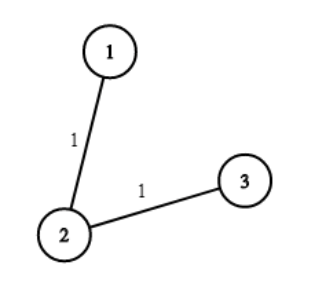

<div align='center' ><font size='70'>水资源分配优化</font></div>

# 题目描述

<a href="https://leetcode-cn.com/problems/optimize-water-distribution-in-a-village/">题目链接</a>

题目描述 :

村里面一共有 n 栋房子。我们希望通过建造水井和铺设管道来为所有房子供水。

对于每个房子 i，我们有两种可选的供水方案：

一种是直接在房子内建造水井，成本为 wells[i]；

另一种是从另一口井铺设管道引水，数组 pipes 给出了在房子间铺设管道的成本，其中每个 pipes[i] = [house1, house2, cost] 代表用管道将 house1 和 house2 连接在一起的成本。当然，连接是双向的。

请你帮忙计算为所有房子都供水的最低总成本。


示例 ：


```
输入：n = 3, wells = [1,2,2], pipes = [[1,2,1],[2,3,1]]
输出：3
解释： 
上图展示了铺设管道连接房屋的成本。
最好的策略是在第一个房子里建造水井（成本为 1），然后将其他房子铺设管道连起来（成本为 2），所以总成本为 3。
```
# 解题思路

并查集，空出的0号作为水库，各个房子打井的成本转化为水库到各个房子的开销。

至少有一个房子要打井，也就是水库必须加入到连通图中。

所以构造一棵包含n+1个点的最小生成树。


# 代码


```java
class Solution {
    public int minCostToSupplyWater(int n, int[] wells, int[][] pipes) {
        DSU dsu = new DSU(n + 1);
        List<int[]> edges = new ArrayList<>();
        int cost = 0;
        int count = 0;
        for (int i = 0; i < n; i++) {
            int[] edge = new int[]{0, i + 1, wells[i]};
            edges.add(edge);
        }
        Collections.addAll(edges, pipes);
        edges.sort((o1, o2) -> o1[2] - o2[2]);
        for (int[] edge : edges) {
            int v1 = edge[0];
            int v2 = edge[1];
            if (dsu.isConnected(v1, v2)) {
                continue;
            }
            dsu.union(v1, v2);
            count++;
            cost += edge[2];
            if (count == n) {
                break;
            }
        }
        return cost;
    }
}

class DSU {
    int[] parent;

    public DSU(int N) {
        parent = new int[N];
        for (int i = 0; i < N; i++) {
            parent[i] = i;
        }
    }

    public int find(int x) {
        if (parent[x] != x) {
            parent[x] = find(parent[x]);
        }
        return parent[x];
    }

    public void union(int x, int y) {
        parent[find(x)] = find(y);
    }

    public boolean isConnected(int x, int y) {
        return find(x) == find(y);
    }

    public int numOfUnion() {
        int num = 0;
        for (int i = 0; i < parent.length; i++) {
            if (parent[i] == i) {
                num++;
            }
        }
        return num;
    }
}
```

