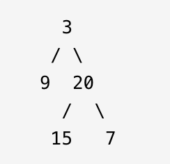
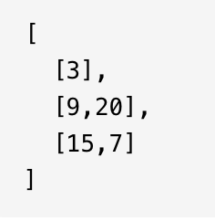

<div align='center' ><font size='70'>二叉树的层序遍历</font></div>

# 题目描述

<a href="https://leetcode-cn.com/problems/binary-tree-level-order-traversal/">题目链接</a>

题目描述 :

给你一个二叉树，请你返回其按 层序遍历 得到的节点值。 （即逐层地，从左到右访问所有节点）。

示例 ：

二叉树：[3,9,20,null,null,15,7],



返回其层序遍历结果：




# 解题思路

二叉树的层序遍历，可以利用队列实现广度优先遍历。

# 代码

```java
/**
 * Definition for a binary tree node.
 * public class TreeNode {
 *     int val;
 *     TreeNode left;
 *     TreeNode right;
 *     TreeNode() {}
 *     TreeNode(int val) { this.val = val; }
 *     TreeNode(int val, TreeNode left, TreeNode right) {
 *         this.val = val;
 *         this.left = left;
 *         this.right = right;
 *     }
 * }
 */

class Solution {
    public List<List<Integer>> levelOrder(TreeNode root) {
        List<List<Integer>> ans = new ArrayList<>();
        Queue<TreeNode> queue = new LinkedList<>();
        if (root != null) {
            queue.offer(root);
        }
        while (!queue.isEmpty()) {
            int size = queue.size();
            List<Integer> level = new ArrayList<>();
            for (int i = 0; i < size; i++) {
                TreeNode cur = queue.poll();
                level.add(cur.val);
                if (cur.left != null) {
                    queue.offer(cur.left);
                }
                if (cur.right != null) {
                    queue.offer(cur.right);
                }
            }
            ans.add(level);
        }
        return ans;
    }
}
```

